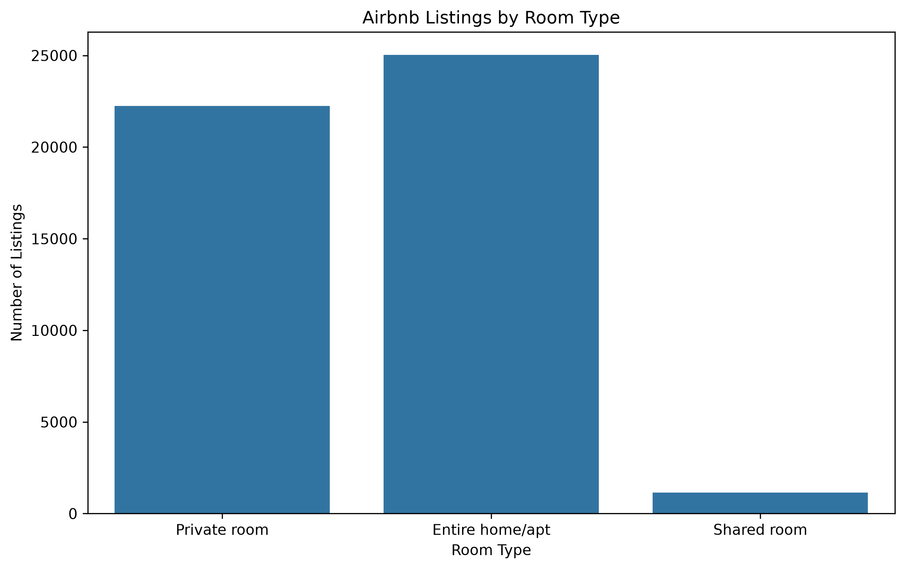
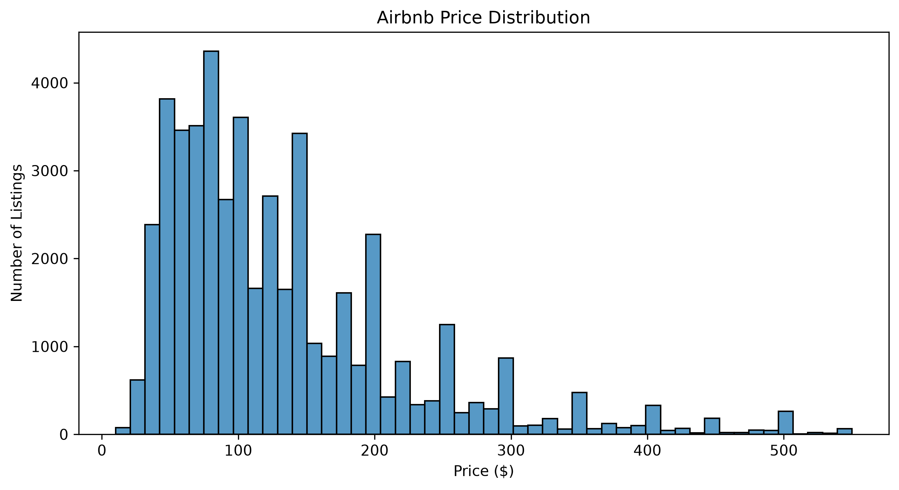
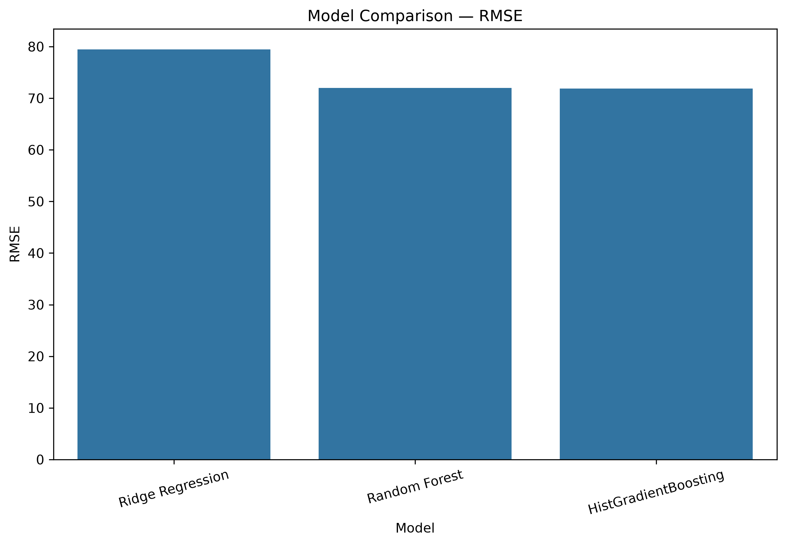
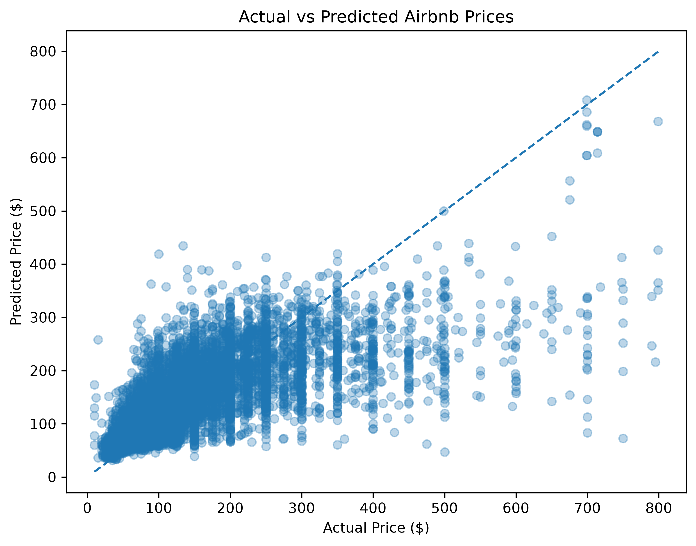
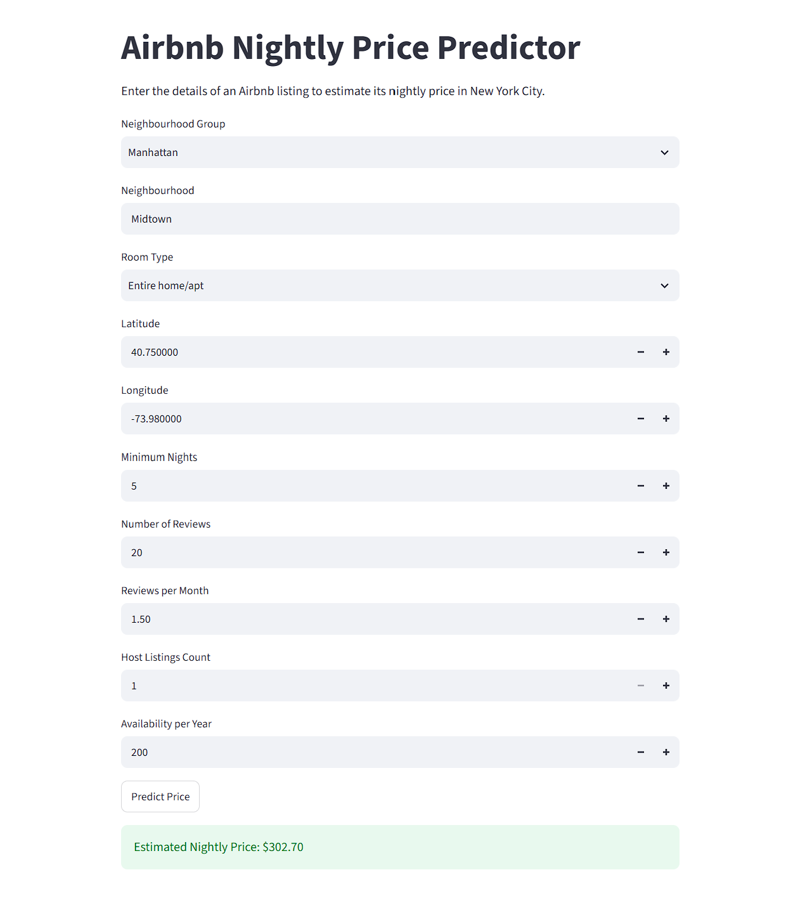

# DS605 Lab Assignment 04 — Airbnb Price Prediction

**Student Name:** Jayesh Hedaoo  
**Student ID:** 202618019  
**Course:** DS605 — Fundamentals of Machine Learning  

---

## Live Application

**[Open the Live Streamlit Application](https://airbnb-price-prediction-jayesh.streamlit.app/)**

This project is deployed as an interactive Streamlit web application for predicting Airbnb listing prices.

---

## 1. Project Overview

This project implements an end-to-end machine learning pipeline for predicting Airbnb listing prices in New York City.

The project covers the complete machine learning workflow, including exploratory data analysis, data cleaning, preprocessing, feature engineering, model development, model comparison, hyperparameter tuning, evaluation, model serialization, and deployment.

The final trained machine learning pipeline is integrated into a Streamlit application that allows users to enter Airbnb listing characteristics and obtain an estimated nightly price.

---

## 2. Dataset

The project uses the **New York City Airbnb Open Data** dataset.

### Dataset File

`AB_NYC_2019.csv`

The dataset contains information about Airbnb listings in New York City, including location, room type, reviews, minimum nights, availability, host information, and price.

### Target Variable

`price`

The objective of the project is to predict the nightly price of an Airbnb listing.

---

## 3. Machine Learning Workflow

The project follows the workflow below:

```text
Raw Dataset
     ↓
Exploratory Data Analysis
     ↓
Data Cleaning
     ↓
Missing Value Analysis
     ↓
Duplicate Detection
     ↓
Outlier Treatment
     ↓
Feature Engineering
     ↓
Feature Selection
     ↓
Train-Test Split
     ↓
Data Preprocessing
     ↓
Model Training
     ↓
Model Comparison
     ↓
Hyperparameter Tuning
     ↓
Final Model Evaluation
     ↓
Model Serialization
     ↓
Streamlit Deployment
```

---

## 4. Feature Engineering

Three additional features were created during the feature engineering stage.

### Availability Ratio

```text
availability_ratio = availability_365 / 365
```

This represents the proportion of the year for which a listing is available.

### Log-Transformed Number of Reviews

```text
reviews_log = log1p(number_of_reviews)
```

This transformation helps reduce the effect of highly skewed review counts.

### Log-Transformed Minimum Nights

```text
minimum_nights_log = log1p(minimum_nights)
```

This transformation helps reduce the influence of highly skewed minimum-stay requirements.

---

## 5. Features Used

The final model uses the following features:

- `neighbourhood_group`
- `neighbourhood`
- `room_type`
- `latitude`
- `longitude`
- `minimum_nights`
- `number_of_reviews`
- `reviews_per_month`
- `calculated_host_listings_count`
- `availability_365`
- `availability_ratio`
- `reviews_log`
- `minimum_nights_log`

### Target

`price`

---

## 6. Data Preprocessing

A Scikit-learn preprocessing pipeline was implemented to ensure consistent preprocessing during both model training and prediction.

### Categorical Features

Missing categorical values were handled using the most frequent value.

Categorical variables were encoded using:

```text
OneHotEncoder(handle_unknown="ignore")
```

### Numerical Features

Missing numerical values were handled using median imputation.

A `ColumnTransformer` was used to combine the categorical and numerical preprocessing steps.

The preprocessing pipeline was incorporated into the model pipeline and saved together with the final trained model.

---

## 7. Models Evaluated

Three regression models were developed and compared:

### Ridge Regression

A regularized linear regression model used as a baseline model.

### Random Forest Regression

An ensemble tree-based regression model capable of capturing nonlinear relationships in the data.

### HistGradientBoosting Regression

A gradient boosting regression model used to capture complex nonlinear relationships efficiently.

---

## 8. Model Comparison

The initial model comparison produced the following results:

| Model | Train R² | Test R² | MAE | RMSE |
|---|---:|---:|---:|---:|
| HistGradientBoosting | 0.5727 | **0.5254** | 44.16 | **71.86** |
| Random Forest | 0.7095 | 0.5238 | **44.01** | 71.98 |
| Ridge Regression | 0.4136 | 0.4197 | 50.01 | 79.47 |

### Evaluation Metrics

The models were evaluated using:

- **R² Score** — measures the proportion of variance explained by the model.
- **MAE (Mean Absolute Error)** — measures the average absolute prediction error.
- **RMSE (Root Mean Squared Error)** — measures prediction error while giving greater weight to larger errors.

Based on the test-set results, **HistGradientBoosting** provided the strongest overall performance, achieving the highest test R² and the lowest RMSE among the three models.

---

## 9. Hyperparameter Tuning

Hyperparameter optimization was performed using `RandomizedSearchCV` with 3-fold cross-validation.

The scoring metric used was negative Root Mean Squared Error.

The HistGradientBoosting model was tuned using parameters including:

- `l2_regularization`
- `learning_rate`
- `max_iter`
- `max_leaf_nodes`

The tuned HistGradientBoosting model was selected as the final model for deployment.

---

## 10. Final Model Evaluation

The final tuned model achieved approximately:

| Metric | Training | Testing |
|---|---:|---:|
| R² Score | 0.5746 | 0.5246 |
| RMSE | $67.60 | $71.93 |

The difference between the training and testing R² scores was approximately **0.05**.

This relatively small performance gap indicates that the final model does not show a severe difference between training and testing performance.

---

## 11. Model Serialization

The final trained machine learning pipeline was saved using Joblib:

```text
airbnb_price_model.pkl
```

The saved pipeline contains the preprocessing steps and trained model, allowing the Streamlit application to load the model and generate predictions without retraining.

---

## 12. Streamlit Application

The project includes an interactive Streamlit application:

```text
app.py
```

The application allows users to enter Airbnb listing characteristics and receive an estimated nightly price.

### Live Application

**[Launch Airbnb Price Prediction App](https://airbnb-price-prediction-jayesh.streamlit.app/)**

---

## 13. Running the Application Locally

### Step 1 — Clone the Repository

```bash
git clone https://github.com/jayeshedaoo/202618019_JayeshHedaoo_DS605.git
```

Navigate to the LAB04 directory:

```bash
cd 202618019_JayeshHedaoo_DS605/202618019_LAB04
```

### Step 2 — Install Dependencies

```bash
pip install -r requirements.txt
```

### Step 3 — Run the Streamlit Application

```bash
streamlit run app.py
```

The application will open in your default web browser.

---

## 14. Project Structure

```text
202618019_LAB04/
│
├── AB_NYC_2019.csv
├── LAB04.ipynb
├── README.md
├── airbnb_price_model.pkl
├── app.py
├── requirements.txt
│
└── screenshots/
    ├── 01_eda.png
    ├── 02_price_distribution.png
    ├── 03_model_comparison.png
    ├── 04_actual_vs_predicted.png
    └── 05_streamlit_app.png
```

---

## 15. Screenshots

### Exploratory Data Analysis



### Price Distribution



### Model Comparison



### Actual vs Predicted Prices



### Streamlit Application



---

## 16. Technologies Used

- Python
- Pandas
- NumPy
- Scikit-learn
- Joblib
- Matplotlib
- Seaborn
- Streamlit
- Jupyter Notebook
- Git
- GitHub

---

## 17. Repository Files

| File | Description |
|---|---|
| `LAB04.ipynb` | Complete machine learning workflow and analysis |
| `AB_NYC_2019.csv` | New York City Airbnb dataset |
| `airbnb_price_model.pkl` | Serialized final machine learning pipeline |
| `app.py` | Streamlit web application |
| `requirements.txt` | Required Python dependencies |
| `screenshots/` | EDA, model evaluation, and application screenshots |
| `README.md` | Project documentation |

---

## 18. Conclusion

This project demonstrates a complete machine learning workflow for Airbnb price prediction, from exploratory data analysis and preprocessing to feature engineering, model comparison, hyperparameter tuning, evaluation, model serialization, and deployment.

Among the evaluated models, HistGradientBoosting achieved the strongest overall test performance. The final trained pipeline was serialized using Joblib and integrated into an interactive Streamlit application.

The deployed application provides a simple interface for generating Airbnb price predictions based on listing characteristics.

---

## Author

**Jayesh Hedaoo**  
**Student ID:** 202618019  
**DS605 — Fundamentals of Machine Learning**

**[GitHub Repository](https://github.com/jayeshedaoo/202618019_JayeshHedaoo_DS605)**  
**[Live Streamlit Application](https://airbnb-price-prediction-jayesh.streamlit.app/)**